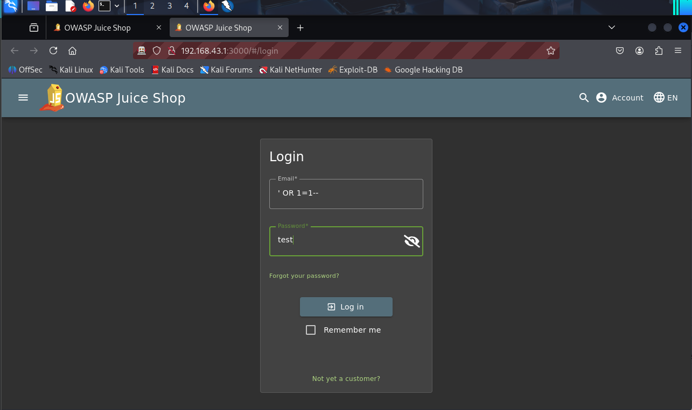
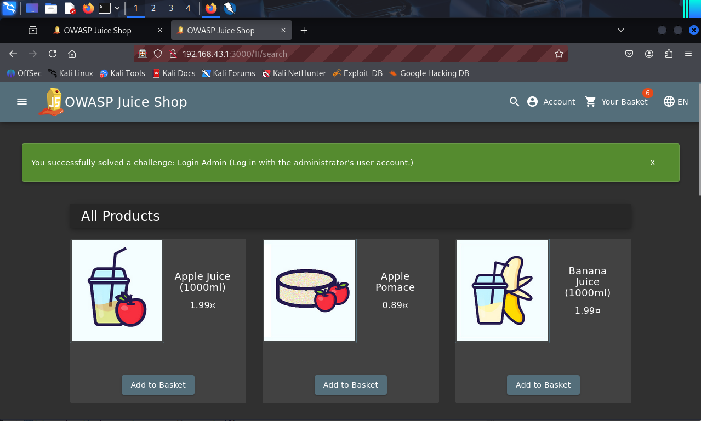
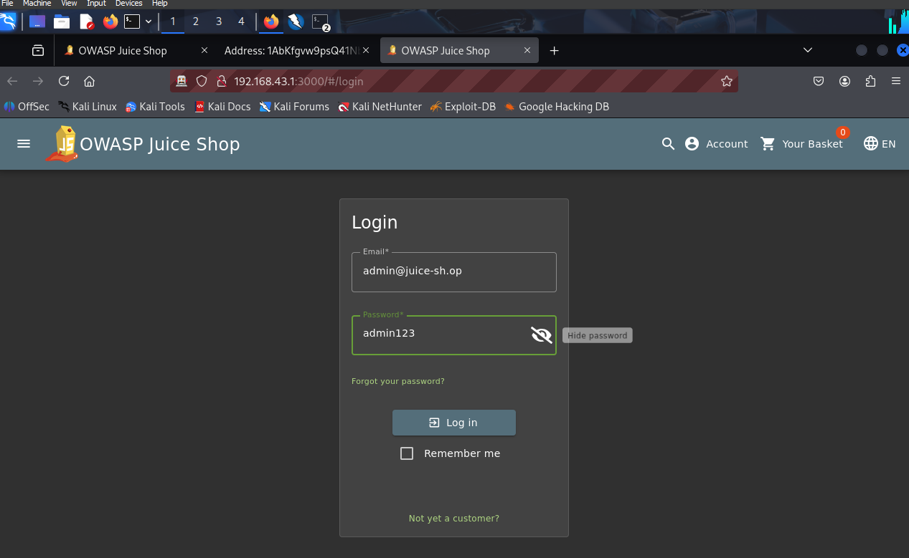
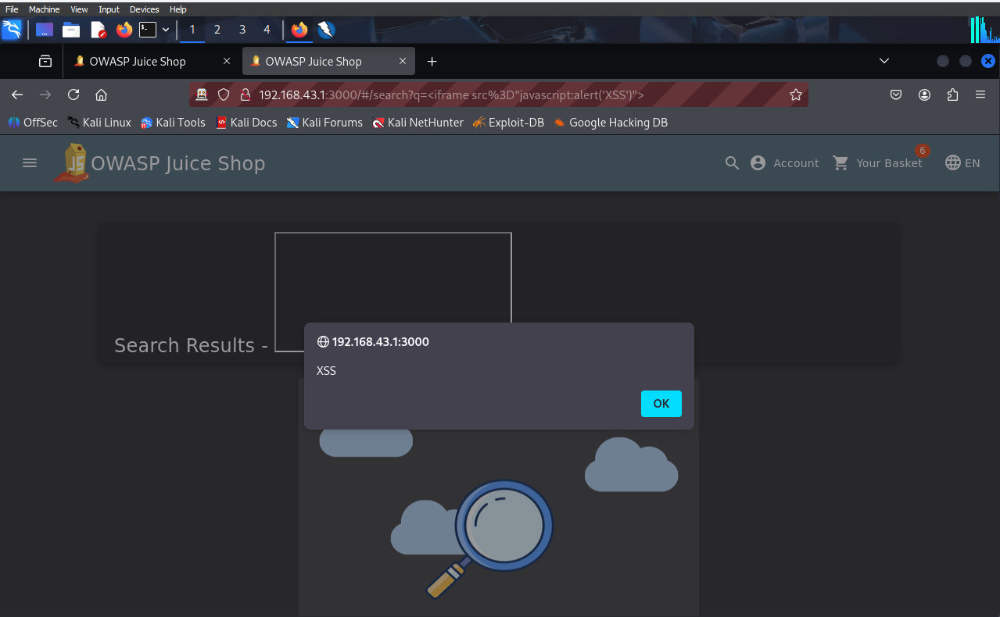
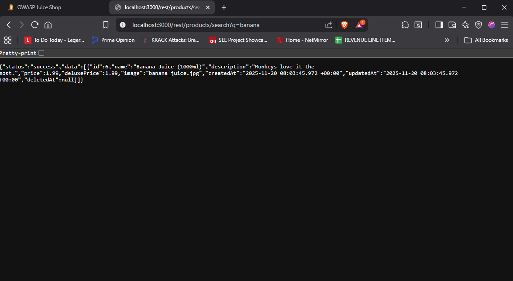

Detailed Vulnerability Write-Up

This section documents each confirmed vulnerability identified during the security assessment of the OWASP Juice Shop web application. For every issue, I’ve included the testing steps I performed, the evidence I collected, and an explanation of why the vulnerability matters from both a security and business perspective. Screenshots are linked below.

4.1 SQL Injection (High Severity)
Overview

During testing, I found that several user-input fields—particularly the search bar and the login form—did not properly validate or sanitize user-supplied data. This allowed me to inject SQL queries into the backend database.

Testing Steps

1. Navigated to the login page.

2 Entered a basic SQL payload into the username field:

 ' OR '1'='1

3. Submitted the login form without providing a valid password.

4. The application responded with a successful authentication message.

Impact

1. Bypassing authentication without valid credentials

2. Possible exposure of user account data

3. Risk of full database compromise

Evidence

4.2 Broken Authentication – Weak Default Password (High Severity)
Overview

The administrator account still used its default credentials. I could log in as the admin using these default passwords.

Testing Steps

1. Navigated to the admin login page.

2. Entered default username/password combinations.

3. The application displayed a pop-up confirming successful admin login.

Impact

1. Full system compromise possible

2. Administrative access exposes all sensitive data

Evidence

4.3 Cross-Site Scripting (XSS) – Reflected (Medium Severity)
Overview

Reflected XSS was discovered in the search bar and other fields where input is reflected back without proper sanitization.

Testing Steps

1. Inserted this payload in a search field:

2. The alert executed immediately upon page reload.

Impact

1. Session hijacking

2. Credential theft

3. Redirection to malicious websites

Evidence

4.4 Open Redirect (Medium Severity)
Overview

Users could be redirected to arbitrary external sites via URL parameters.

Testing Steps

1. Opened the redirect URL on the Juice Shop instance:

http://<your-ip>:3000/redirect?to=https://blockchain.info/address/1AbKfgvw9psQ41NbLi8kufDQTezwG8DRZm

2. Observed the redirect and pop-up confirming the challenge solved.

Impact

1. Users can be redirected to malicious sites

2. Could be used in phishing attacks

Evidence

4.5 Security Misconfiguration – Exposed API / Debug Info (Medium Severity)
Overview

Accessible directories and endpoints exposed information about the application and products without authentication.

Testing Steps

1. Used manual exploration of /api/products and /debug/ endpoints

2. Observed sensitive information returned in JSON format

Impact

1. Information disclosure increases attack surface

2. Could help attackers craft further attacks

Evidence

4.6 Input Validation Issues (Low Severity)
Overview

During testing, I observed that several input fields, particularly the search bar, accepted unusual and unexpected characters without proper validation. While the application correctly displayed "No results found" when the input did not match any products, it still echoed the entire user input on the page. This behavior indicates weak input validation.

Testing Steps

1. Navigated to the search bar on the Juice Shop main page.

2. Entered a mixture of special characters, symbols, and a long string:

!@#$%^&*()_+{}[]:";'<>?/AAAAAAAAAAAAAAAAAAAAAAAAAAAA

3. Pressed Enter to submit the search.

4. Observed that the page displayed "No results found," but the exact input was printed on the page in bold.

Impact

1. Shows that the application does not properly validate user input.

2. Could increase the likelihood of future injection or XSS vulnerabilities if other parts of the application use this input unsafely.

3. Demonstrates a minor security misconfiguration in input handling.

Evidence

4.7 Weak WPA2 Passphrase on Lab SSID (High Severity) Overview

As part of the wireless lab, I configured a dedicated test Wi Fi network on my OnePlus 7 Pro hotspot with the SSID `CIS145-LAB`. The network used WPA2 Personal security but intentionally relied on a short numeric passphrase (`123456789`) to model a weak configuration that is still common in real life. By capturing a WPA2 4 way handshake and running an offline dictionary attack against it, I was able to recover this password almost immediately.

Testing Steps

1. Configured the OnePlus 7 Pro mobile hotspot with:
   - SSID: `CIS145-LAB`
   - Security: WPA2 Personal
   - Passphrase: `123456789` (intentionally weak for lab purposes)

2. Connected a Lenovo Legion laptop to `CIS145-LAB` as a normal Wi Fi client.

3. On a Microsoft Surface laptop running Kali Linux, switched the wireless interface into monitor mode and used a wireless discovery tool to locate `CIS145-LAB`, recording its BSSID and channel.

4. Started a packet capture on the Surface (focused on the channel used by `CIS145-LAB`) and saved all frames into `lab_wifi_handshake.pcap`.

5. While the capture was running, disconnected the Legion from `CIS145-LAB` and then reconnected it using the same passphrase. This forced a new WPA2 4 way handshake between the hotspot and the client.

6. Opened `lab_wifi_handshake.pcap` in Wireshark and filtered for `eapol`, confirming that the four handshake messages between the hotspot MAC address and the Legion Wi Fi MAC address were present.

7. Created a small wordlist file (`weak_words.txt`) containing common weak passwords and numeric patterns, including `123456789`.

8. Used a standard WPA key recovery tool on the Surface Kali machine to test the captured handshake against `weak_words.txt` in an offline attack.

9. The tool successfully recovered the passphrase `123456789` from the small wordlist in a very short amount of time.

Impact

- An attacker who is in range of the network and can capture a WPA2 handshake could recover the weak passphrase with minimal effort using basic tools and a small dictionary of weak passwords.
- Once the passphrase is known, the attacker can join the Wi Fi network as a trusted client, intercept unencrypted traffic, and launch further attacks against internal hosts or services.
- In a real environment, this could lead to sensitive data exposure, credential theft, and the ability to pivot deeper into the organization’s infrastructure.

Evidence

- `lab_wifi_handshake.pcap` containing the captured WPA2 handshake for `CIS145-LAB`.
- Wireshark screenshot showing the four EAPOL handshake frames between the hotspot and the client.
- Screenshot or terminal output from the WPA key recovery tool showing that the passphrase `123456789` was successfully recovered from the `weak_words.txt` dictionary.
4.9 Insecure Hardware Protocols – RFID and IR Replay (Low Severity) Overview

To complement the network focused tests, I used a Flipper Zero device to demonstrate how weak or unauthenticated hardware protocols can be abused in a lab setting. The goal was not to attack real infrastructure, but to show that many basic RFID, NFC, and infrared (IR) systems do not include strong security controls and can be cloned or replayed if an attacker gets temporary access to a legitimate tag or remote.

Testing Steps

RFID/NFC Cloning

1. Selected a test RFID or NFC tag that I was explicitly allowed to use in the lab environment.

2. Used the Flipper Zero to scan the tag and identify its type, frequency, and unique identifier.

3. Saved the tag profile into the Flipper’s memory.

4. Switched the Flipper Zero into emulation mode and attempted to use it in place of the original tag in the same test scenario.

5. Observed whether the target system accepted the emulated tag as if it were the original.

Infrared (IR) Capture and Replay

6. Identified a lab friendly IR controlled device, such as a TV, monitor, or projector.

7. Used the Flipper Zero IR receiver to capture remote control signals for basic functions like power or input selection.

8. Saved the captured IR commands on the Flipper with descriptive names.

9. Pointed the Flipper Zero at the device and replayed the stored commands.

10. Confirmed that the device responded to the replayed commands in the same way it responds to the original remote.

Impact

- Many low cost RFID and NFC systems rely on static identifiers without encryption or challenge response protocols, which makes them vulnerable to cloning. An attacker who briefly has access to a tag could copy it and later use the cloned version to trigger the same action.

- IR remote signals are usually broadcast in clear form without any authentication. An attacker with a device like the Flipper Zero can capture and replay these commands to disrupt presentations, change inputs, or interact with devices that might expose more sensitive functions.

- In a real environment, insecure hardware protocols can be combined with network attacks, for example by using a cloned access tag to enter a restricted area and then connecting a malicious device to the internal network.

Evidence

- Screenshots or photos of the Flipper Zero screen showing the scanned RFID or NFC tag information and the emulation profile.

- Screenshots or photos showing the list of stored IR commands on the Flipper and the successful replay of a command (for example, turning a display on or off).

- Notes from the lab describing which tags and devices were tested and confirming that only lab approved or personally owned equipment was used.

